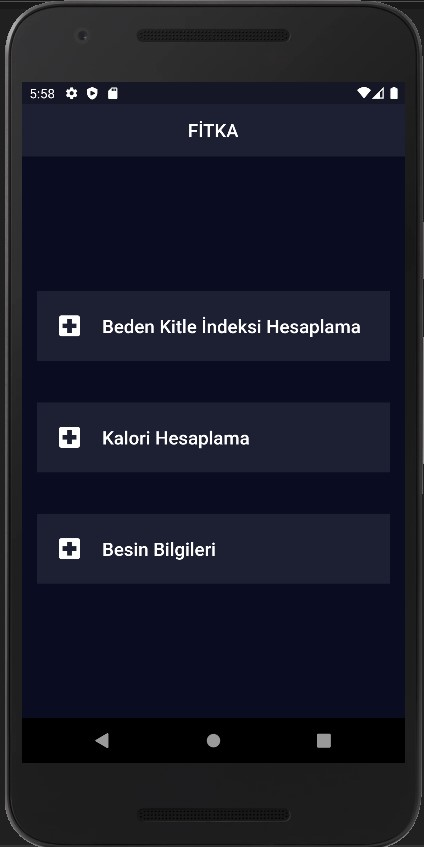
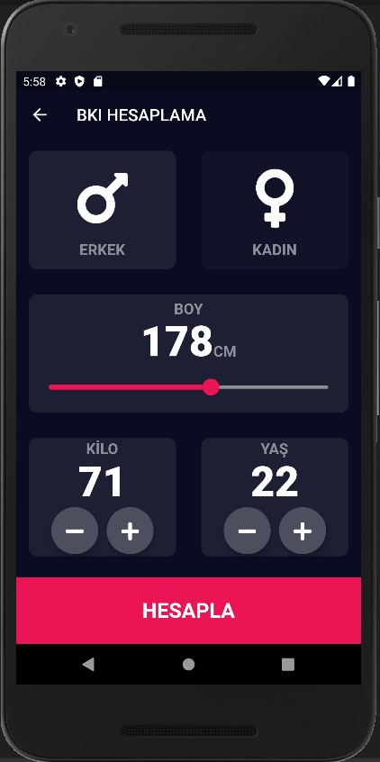
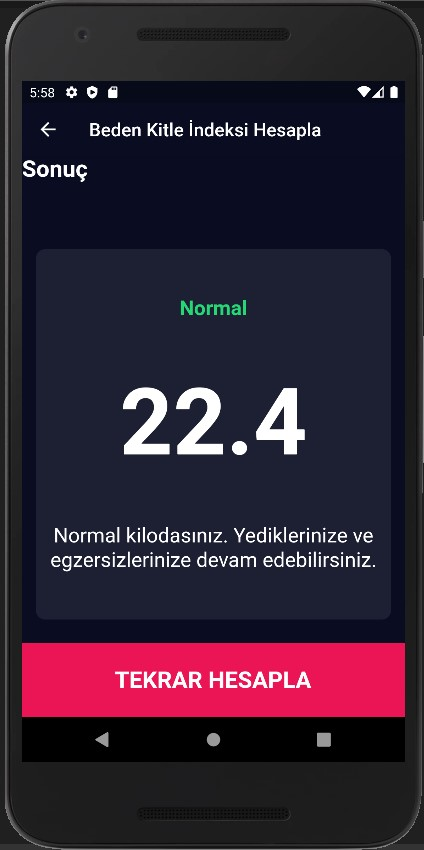
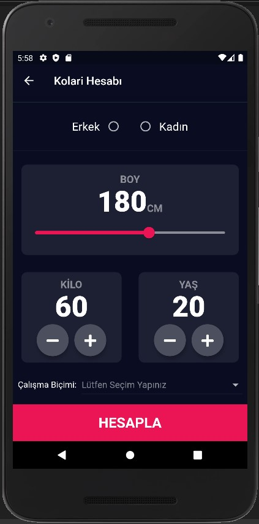
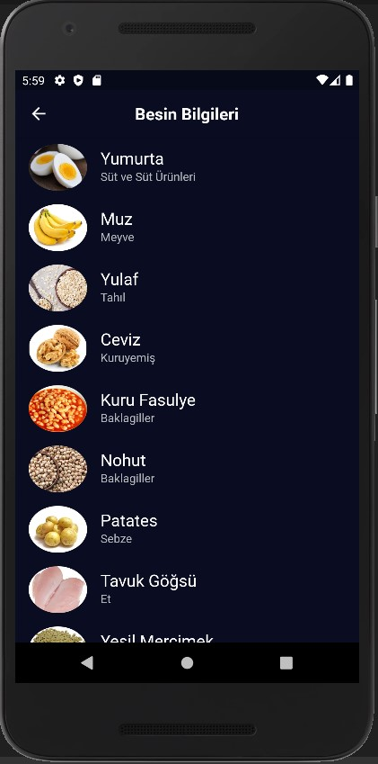
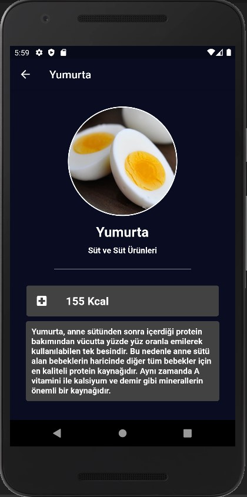

# Flutter Dart Sağlık Uygulaması

Uygulama içerisinde Beden kitle hesabı ve kalori hesabı yapılmaktadır. Uygulamanın içerisinde besin bilgileri yer almaktadır. Besin bilgileri sayfasında
Json veriden yardım aldım. 

Uygulamanın tam hali için;

### Benimle İletişime Geç

&nbsp;&nbsp;

&nbsp;&nbsp;

# Tasarım 

&nbsp;&nbsp;

&nbsp;&nbsp;

&nbsp;&nbsp;

&nbsp;&nbsp;

&nbsp;&nbsp;

&nbsp;&nbsp;

&nbsp;&nbsp;

